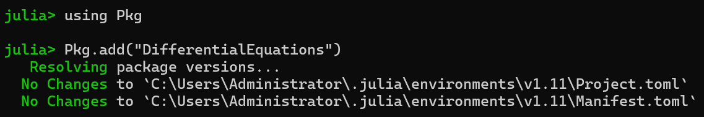
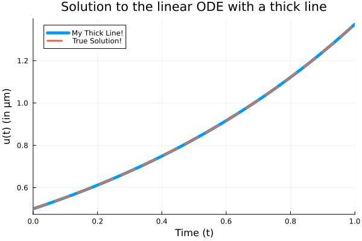

---
# DifferentialEquations.jl包
---
今天我们来简单的介绍一下 `Julia` 语言当中比较常用的包 `DifferentialEquations.jl`，这个包在我们求解微分方程的数值解中可以做到非常完美的求解，并给出图像。

# 安装与引用 DifferentialEquations.jl 包
打开 Julia 的 REPL ，在里面直接输入如下的代码
```julia
    julia> using Pkg
    julia> Pkg.add("DifferentialEquations")
```



如这幅图一样，只是我这里已经安装完了

使用的话也是直接
```julia
    using DifferentialEquations
```

介绍完这个，那么接下来，我们就直接进入到基础的使用环节

# DifferentialEquations.jl 包的基础使用方法与基础参数

老规矩，我们边看帮助文档边讲解一下里面的案例，从而达到学习的目的

## 求解标量方程

在这个例子当中，求解的例子是一个简单的可分离变量的常微分方程
$$
\frac{d u}{d t}=f(u,p,t)
$$

其中，求解的时间范围是 $t\in [0,1]$ ,待求解方程的右边是 $f(u,p,t)=\alpha u$ ,对于这样的方程，我们很容易知道他的解析解为
$$
u(t)=u_0 e^{\alpha t}
$$

接下来，我们将比较一下，通过 `DifferentialEquations,jl` 求解出来的数值解与解析解绘制在同一个图像上来进行对比。

给出代码
```julia
# 定义问题
f(u,p,t) = 1.01 * u                  # 标量方程的右边
u_0 = 1/2                              # 标量方程的初值
t_span = (0.0 , 1.0)                # 求解范围
prob = ODEProblem(f, u_0, t_span)  #问题的定义
# 解决问题，使用solve函数
sol = solve(prob, BS3(),reltol = 1e-8)# 对问题的求解
plot(sol)                               
plot!(sol.t,t->0.5 * exp(1.01 * t)) 
plot(sol, linewidth = 5, title = "Solution to the linear ODE with a thick line",xaxis = "Time (t)", yaxis = "u(t) (in μm)", label = "My Thick Line!") # 绘制出数值解图像
plot!(sol.t, t -> 0.5 * exp(1.01t), lw = 3, ls = :dash, label = "True Solution!")# 在同一个画布上绘制出解析解图像
```
图片如下

### 代码精讲


